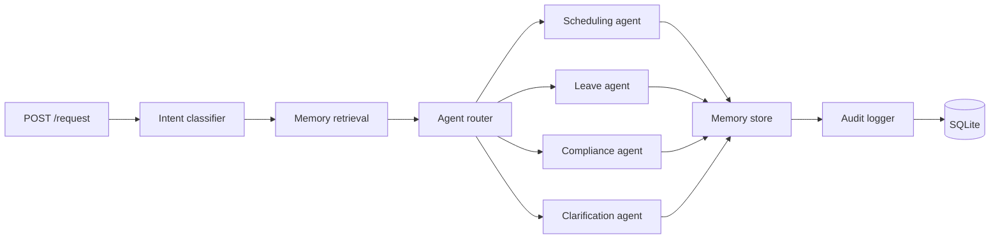
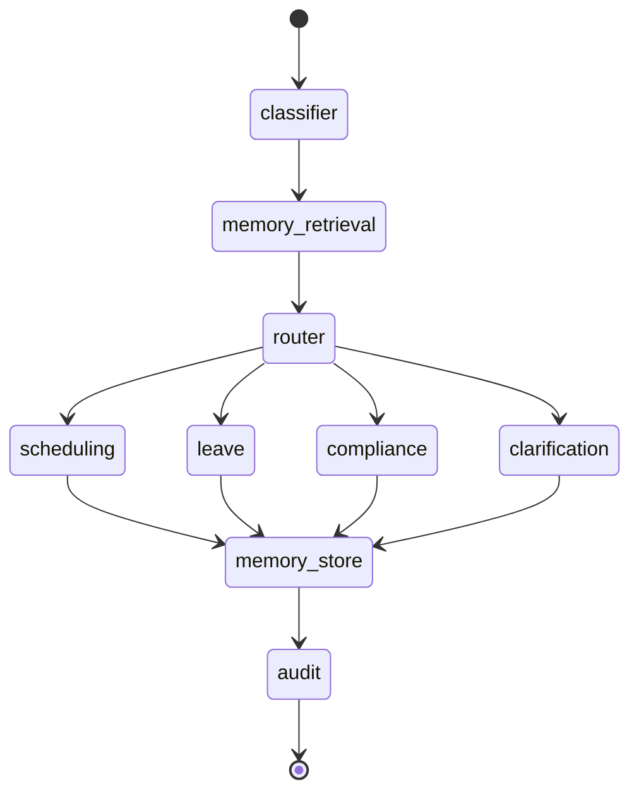

# Multi-Agent HR Automation Platform

An HR request orchestration service built with FastAPI, LangGraph, SQLite, and lightweight agent stubs for scheduling, leave, compliance, and clarification flows.

The system accepts an HR request, classifies the intent, retrieves memory, routes the request to a sub-agent, stores short-term and long-term memory, and writes an audit record. It also exposes a small REST API for request handling, audit retrieval, memory inspection, health checks, and the FastAPI documentation UI.

## Tech Stack

- Python 3.11+
- FastAPI
- LangGraph
- SQLite
- Pydantic
- python-dotenv
- Groq LLM API client

## Project Structure

- `app/main.py`: FastAPI application bootstrap and global exception handling
- `app/api/routes.py`: REST API endpoints
- `app/agents/`: classifier, router, workflow graph, and sub-agent handlers
- `app/memory/`: STM, LTM, retrieval, and significance scoring
- `app/audit/logger.py`: append-only audit logging node
- `app/core/database.py`: SQLite connection and schema initialization
- `app/services/llm_service.py`: LLM response generation and fallback handling
- `tests/`: mocked endpoint tests and fixtures

## Architecture

The application is organized as a small orchestration pipeline around LangGraph.



### Data Flow

1. The user submits a request through `POST /request`.
2. The classifier assigns an intent and confidence score.
3. The retriever fetches short-term and long-term memory for the user.
4. The router sends the request to the matching sub-agent.
5. The sub-agent generates a response with the LLM service.
6. The memory node stores STM and conditionally stores LTM.
7. The audit node appends an audit record.

## Agentic Workflow

The LangGraph workflow in `app/agents/orchestrator.py` is:



### Intent Classification

The classifier performs keyword-based scoring for these intents:

- `scheduling`
- `leave`
- `compliance`
- `clarification`

If no clear match is found, or if the best score is below the low-confidence threshold, the request falls back to `clarification`.

### Routing Policy

The router maps the resolved intent to the appropriate agent:

- `scheduling` -> scheduling agent
- `leave` -> leave agent
- `compliance` -> compliance agent
- anything uncertain -> clarification agent

## Memory System

The platform uses a two-tier memory model.

### Short-Term Memory (STM)

- Stores recent request/response pairs in SQLite.
- Retrieved per user and injected into the agent prompt.
- Used to preserve local conversational context.

### Long-Term Memory (LTM)

- Stores important messages with an `importance_score`.
- The scoring logic is heuristic-based and intentionally small.
- Memory is written to LTM only when the score crosses the storage threshold.

### Retrieval Behavior

- STM returns the most recent 5 entries per user.
- LTM returns the most important entries per user.

## Audit Logging

Audit logging is append-only at the database level.

- Each request generates an audit record.
- The audit table includes `created_at`.
- UPDATE and DELETE operations are blocked with SQLite triggers.
- Audit retrieval sorts newest first using `created_at`.

## REST API

### `GET /`

Returns the service metadata and endpoint list.

### `POST /request`

Submits an HR request into the LangGraph workflow.

Example:

```json
{
	"user_id": "u-100",
	"message": "Schedule a meeting with HR next week"
}
```

### `GET /audit`

Returns audit log rows ordered from newest to oldest.

### `GET /memory/{user_id}`

Returns short-term and long-term memory for a user.

### `GET /health`

Returns a lightweight health response.

### `GET /docs`

FastAPI Swagger UI for exploring the API and submitting requests.

## Setup

### 1. Create and activate a virtual environment

```powershell
python -m venv venv
venv\Scripts\Activate.ps1
```

### 2. Install dependencies

```powershell
pip install -r requirements.txt
```

### 3. Configure environment variables

Copy `.env.example` to `.env` and set your API key.

```env
GROQ_API_KEY=your_api_key_here
```

### 4. Run the app

```powershell
uvicorn app.main:app --reload
```

Open the service at:

- `http://127.0.0.1:8000/`
- `http://127.0.0.1:8000/docs`

## Running Tests

The repository includes mocked endpoint tests and a fixture file under `tests/`.

```powershell
python -m unittest discover -s tests -p "test_*.py"
```

The tests cover:

- root metadata endpoint
- request orchestration endpoint with a mocked LangGraph call
- audit retrieval
- memory retrieval
- health endpoint

## Mock Data

The test fixture in `tests/fixtures/mock_data.json` contains sample:

- request results
- audit rows
- short-term memory rows
- long-term memory rows

This keeps validation deterministic and avoids live LLM calls during tests.

## Error Handling

The application includes centralized FastAPI exception handlers so users receive polite JSON errors instead of raw stack traces.

- validation errors return a structured 422 response
- unexpected failures return a generic 500 response

The LLM service also falls back gracefully if the API key is missing or the provider call fails.

## Current Trade-offs

- Intent classification is keyword-based rather than model-based.
- LTM significance scoring is heuristic, not learned.
- Agents are lightweight stubs rather than fully specialized business processors.
- The project is intentionally small and demo-friendly, with mocked tests to keep validation stable.

## Notes

- The SQLite database file is created automatically as `app.db`.
- The API uses FastAPI's built-in Swagger docs at `/docs`.
- If you change the schema manually, delete `app.db` only if you want a fresh database.

## What This System Demonstrates

- modular agent boundaries
- LangGraph-based orchestration
- memory injection into agent prompts
- audit logging with append-only enforcement
- failure-safe LLM fallback behavior
- end-to-end API coverage with mock data

